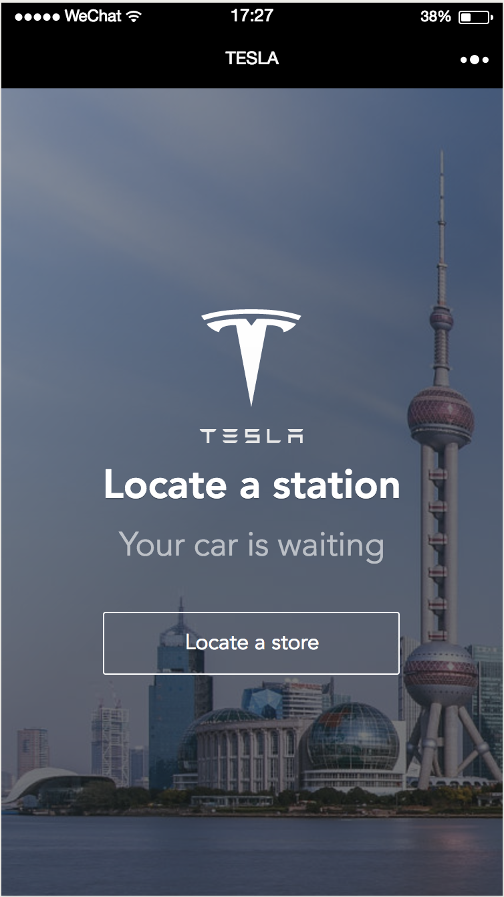

# Coding in WeChat

Become a WXML programmer today!
 
## Background & Objectives

In this challenge, you will build a 1-page WeChat program and use the proprietary **WXML** (Weixin Markup Language) 😉

Refresher:

- **HTML** is the skeleton of your page, the walls of your house
- **CSS** is the paint on your walls
- **JSON** is raw data used by machines to exchange info
- **WXML** is a smarter markup language than HTML, made by WeChat. It works with **WXSS**.

## Step 1: setup

Install the WeChat IDE on your computer.

1. Download the [IDE](https://mp.weixin.qq.com/debug/wxadoc/dev/devtools/download.html)
2. Login with your WeChat account
3. Create a new project:
	- Select a location on your computer
	- Skip the AppID
	- Give a name to your project

4. Modify the `app.json` configuration file with *pages*, *window*, *tabbar*... 👉[Check all your options here](http://open.wechat.com/cgi-bin/newreadtemplate?t=overseas_open/docs/mini-programs/development/framework/config#framework_config)

**Do it now!**

## Step 2: write your markup

- `page.wxml` is the markup of your WeChat view
- `page.wxss` is the style of your WeChat view
- you can also use the `app.wxss` to apply global style on all views of your app...

### 1. Create your first view

1. In WXML, instead of `
` we use the `<view>` tag.
2. `H1`, `H2`, `P` etc are replaced by a unique `<text>` tag.
3. `IMG` is replaced by the `<image>` tag 
4. You can style all tags with `class="yourclassname"`.

Here's the view you want to make:

**Do it now!** 

Tips:

- To get a picture of Shanghai in the background, you can inject this inline style on your main view: `style="background-image: linear-gradient(-225deg, rgba(100,100,100,0.6) 0%, rgba(30,30,30,0.6) 50%), url('https://kitt.lewagon.com/placeholder/cities/shanghai');"`
- Here's the [TESLA logo](https://daks2k3a4ib2z.cloudfront.net/547414e29422435b31d2b20a/5474157d427d445d31bd5709_tesla-logo.svg)
- Did you know you can cover an entire page thanks to `height: 100vh;` ? (vh is a special unit, for *viewport-height*)
- Have you ever heard of **CSS Flexbox**? This technique is very  convenient to center elements in the page... and fully compatible with WeChat. Look it up now.

[Click here to reveal the solution](solution/)

### 2. Link to another view

1. Add a new page in `app.json`
2. Links can be made with:
 - the 'tabbar' in `app.json`
 - or the `<navigator>` component (👉[documentation here](http://open.wechat.com/cgi-bin/newreadtemplate?t=overseas_open/docs/mini-programs/development/component/navigator#component_navigator))

### 3. Explore the components library!

The WeChat framework provides series of base components for developers to build fast. 

1. Explore the documentation and experiment with:

	- [form components](http://open.wechat.com/cgi-bin/newreadtemplate?t=overseas_open/docs/mini-programs/development/component/button#component_button)
	- [multimedia components](http://open.wechat.com/cgi-bin/newreadtemplate?t=overseas_open/docs/mini-programs/development/component/audio#component_audio)

2. Read more about the [WXML capabilities](http://open.wechat.com/cgi-bin/newreadtemplate?t=overseas_open/docs/mini-programs/development/framework/view/wxml/index#wxml_index), try it! We will explore it tomorrow.